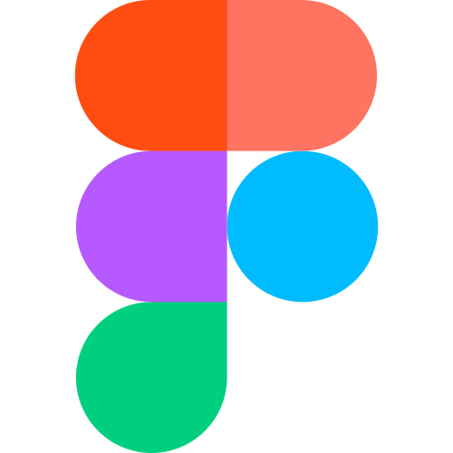
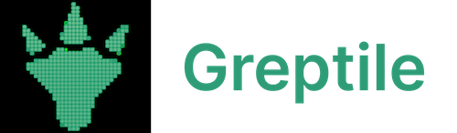

 

  

<h2 align="center" >The #1 Open-Source CRM </h2>

<a href="https://twenty.com">🌐 Website</a> · <a href="https://twenty.com/developers">📚 Documentation</a> · <a href="https://github.com/orgs/twentyhq/projects/1"> Roadmap </a> · <a href="https://discord.gg/cx5n4Jzs57"> Discord</a> · <a href="https://www.figma.com/file/xt8O9mFeLl46C5InWwoMrN/Twenty">  Figma</a>

 

  <a href="https://www.twenty.com">
    <picture>
      <source media="(prefers-color-scheme: dark)" srcset="https://raw.githubusercontent.com/twentyhq/twenty/v0.12.0/packages/twenty-docs/static/img/preview-dark.png" />
      <source media="(prefers-color-scheme: light)" srcset="https://raw.githubusercontent.com/twentyhq/twenty/v0.12.0/packages/twenty-docs/static/img/preview-light.png" />
      
    </picture>
  </a>

 

# Installation 

See:  
🚀 [Self-hosting](https://twenty.com/developers/section/self-hosting)  
🖥️ [Local Setup](https://twenty.com/developers/local-setup)  

# Does the world need another CRM?

We built Twenty for three reasons:

**CRMs are too expensive, and users are trapped.** Companies use locked-in customer data to hike prices. It shouldn't be that way.

**A fresh start is required to build a better experience.** We can learn from past mistakes and craft a cohesive experience inspired by new UX patterns from tools like Notion, Airtable or Linear.

**We believe in Open-source and community.** Hundreds of developers are already building Twenty together. Once we have plugin capabilities, a whole ecosystem will grow around it.

 

# What You Can Do With Twenty
We're currently developing Twenty's beta version.  

Please feel free to flag any specific needs you have by creating an issue.   

Below are a few features we have implemented to date:

+ [Add, filter, sort, edit, and track customers](#add-filter-sort-edit-and-track-customers)
+ [Create one or several opportunities for each company](#create-one-or-several-opportunities-for-each-company)
+ [See rich notes tasks displayed in a timeline](#see-rich-notes-tasks-displayed-in-a-timeline)
+ [Create tasks on records](#create-tasks-on-records)
+ [Navigate quickly through the app using keyboard shortcuts and search](#navigate-quickly-through-the-app-using-keyboard-shortcuts-and-search)

## Add, filter, sort, edit, and track customers:

    <picture>
      <source media="(prefers-color-scheme: dark)" srcset="https://raw.githubusercontent.com/twentyhq/twenty/v0.12.0/packages/twenty-docs/static/img/index-dark.png" />
      <source media="(prefers-color-scheme: light)" srcset="https://raw.githubusercontent.com/twentyhq/twenty/v0.12.0/packages/twenty-docs/static/img/index-light.png" />
      
    </picture>

## Create one or several opportunities for each company:

    <picture>
      <source media="(prefers-color-scheme: dark)" srcset="https://raw.githubusercontent.com/twentyhq/twenty/v0.12.0/packages/twenty-docs/static/img/kanban-dark.png" />
      <source media="(prefers-color-scheme: light)" srcset="https://raw.githubusercontent.com/twentyhq/twenty/v0.12.0/packages/twenty-docs/static/img/kanban-light.png" />
      
    </picture>

## Track deals effortlessly with the email integration:

    <picture>
      <source media="(prefers-color-scheme: dark)" srcset="https://raw.githubusercontent.com/twentyhq/twenty/v0.12.0/packages/twenty-docs/static/img/emails-dark.png" />
      <source media="(prefers-color-scheme: light)" srcset="https://raw.githubusercontent.com/twentyhq/twenty/v0.12.0/packages/twenty-docs/static/img/emails-light.png" />
      
    </picture>

## Tailor your data model to meet business needs:

    <picture>
      <source media="(prefers-color-scheme: dark)" srcset="https://raw.githubusercontent.com/twentyhq/twenty/v0.12.0/packages/twenty-docs/static/img/data-dark.png" />
      <source media="(prefers-color-scheme: light)" srcset="https://raw.githubusercontent.com/twentyhq/twenty/v0.12.0/packages/twenty-docs/static/img/data-light.png" />
      
    </picture>

## See rich notes displayed in a timeline:

    <picture>
      <source media="(prefers-color-scheme: dark)" srcset="https://raw.githubusercontent.com/twentyhq/twenty/v0.12.0/packages/twenty-docs/static/img/notes-dark.png" />
      <source media="(prefers-color-scheme: light)" srcset="https://raw.githubusercontent.com/twentyhq/twenty/v0.12.0/packages/twenty-docs/static/img/notes-light.png" />
      
    </picture>

## Create tasks on records

    <picture>
      <source media="(prefers-color-scheme: dark)" srcset="https://raw.githubusercontent.com/twentyhq/twenty/v0.12.0/packages/twenty-docs/static/img/tasks-dark.png" />
      <source media="(prefers-color-scheme: light)" srcset="https://raw.githubusercontent.com/twentyhq/twenty/v0.12.0/packages/twenty-docs/static/img/tasks-light.png" />
      
    </picture>

## Navigate quickly through the app using keyboard shortcuts and search:

    <picture>
      <source media="(prefers-color-scheme: dark)" srcset="https://raw.githubusercontent.com/twentyhq/twenty/v0.12.0/packages/twenty-docs/static/img/keyboard-dark.png" />
      <source media="(prefers-color-scheme: light)" srcset="https://raw.githubusercontent.com/twentyhq/twenty/v0.12.0/packages/twenty-docs/static/img/keyboard-light.png" />
      
    </picture>

## Connect your CRM to all your tools through our APIs and Webhooks.

    <picture>
      <source media="(prefers-color-scheme: dark)" srcset="https://raw.githubusercontent.com/twentyhq/twenty/v0.12.0/packages/twenty-docs/static/img/api-dark.png" />
      <source media="(prefers-color-scheme: light)" srcset="https://raw.githubusercontent.com/twentyhq/twenty/v0.12.0/packages/twenty-docs/static/img/api-light.png" />
      
    </picture>

## Swagger документация

Swagger UI доступен по адресу: http://localhost:3000/api/docs

Документация покрывает модель User и все основные CRUD-операции, включая примеры, описания параметров, моделей, ответов и ошибок. Для генерации схемы используются декораторы @ApiProperty, @ApiOperation, @ApiResponse и другие из @nestjs/swagger.

### Быстрый старт для Swagger:
1. Запусти сервер: `yarn workspace twenty-server start`
2. Перейди по адресу [http://localhost:3000/api/docs](http://localhost:3000/api/docs)

### Пример описания модели User:
- Все поля пользователя снабжены примерами и описаниями.
- CRUD-операции пользователя снабжены описаниями, схемами входных и выходных данных.

 

# Stack
- [TypeScript](https://www.typescriptlang.org/)
- [Nx](https://nx.dev/)
- [NestJS](https://nestjs.com/), with [BullMQ](https://bullmq.io/), [PostgreSQL](https://www.postgresql.org/), [Redis](https://redis.io/)
- [React](https://reactjs.org/), with [Recoil](https://recoiljs.org/), [Emotion](https://emotion.sh/) and [Lingui](https://lingui.dev/)

# Thanks

  
  
  
  

  Thanks to these amazing services that we use and recommend for UI testing (Chromatic), code review (Greptile), catching bugs (Sentry) and translating (Crowdin).

# Join the Community

- Star the repo
- Subscribe to releases (watch -> custom -> releases)
- Follow us on [Twitter](https://twitter.com/twentycrm) or [LinkedIn](https://www.linkedin.com/company/twenty/) 
- Join our [Discord](https://discord.gg/cx5n4Jzs57)
- Improve translations on [Crowdin](https://twenty.crowdin.com/twenty) 
- [Contributions](https://github.com/twentyhq/twenty/contribute) are, of course, most welcome! 
